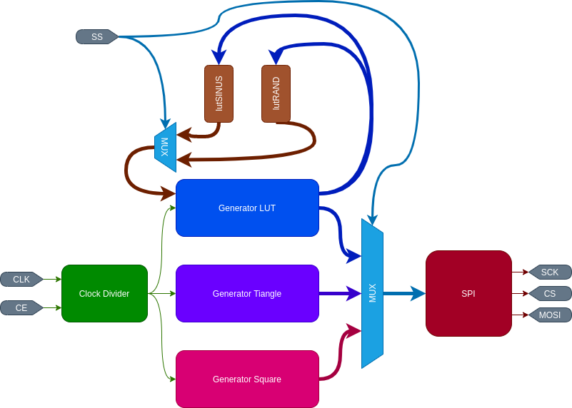
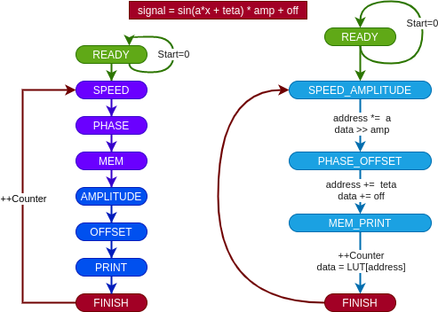
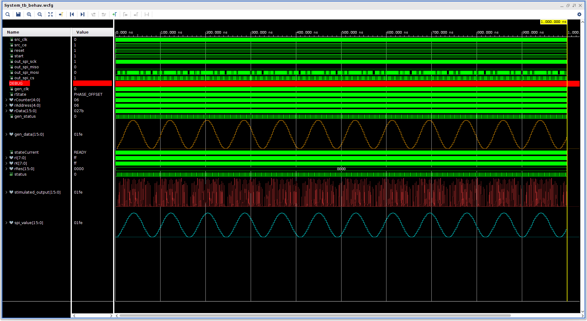
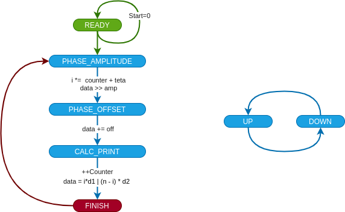
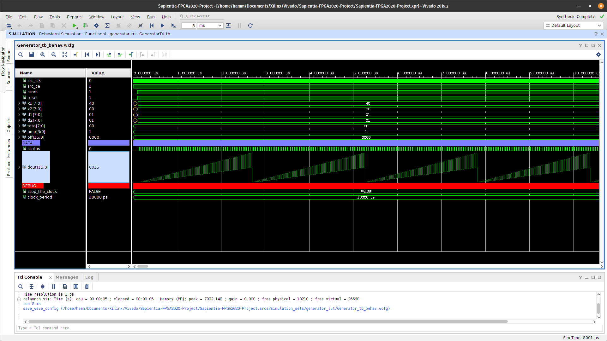
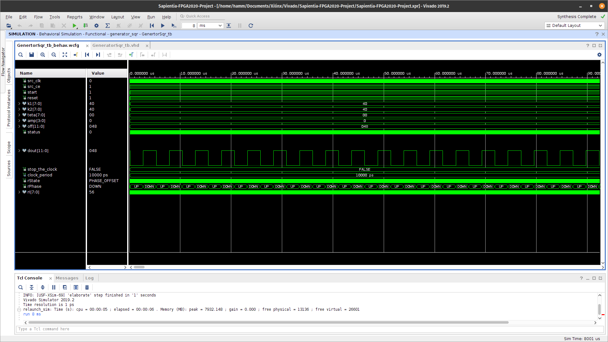
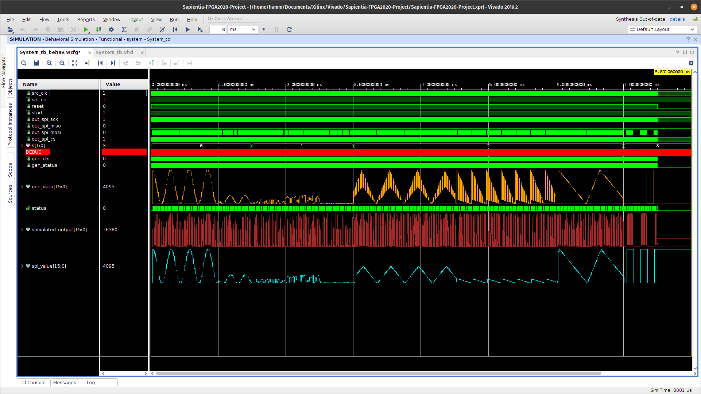

# Sapientia-FPGA2020-Project

During FPGA2020 course we had to create a wawe generator which could create the following wawe types: sin, triangle, square, random.
The data was sent out using [Pmod DA2](https://reference.digilentinc.com/reference/pmod/pmodda2/reference-manual) 12 bit digital to analog converter. A simplified blockdiagram:

## Inputs

| Input name   |  Iput width   | Description                                                                                                       |
| :----------- | :-----------: | :---------------------------------------------------------------------------------------------------------------- |
| src_clk      |       1       | Source clock.                                                                                                     |
| src_ce       |       1       | Clock enable (ActiveWhenHigh/ActiveWhwnLow can be sett using the CE constant in System.vhd).                      |
| reset        |       1       | Reset (ActiveWhwnLow/ActiveWhenHigh can be sett using the RST constant in System.vhd).                            |
| start        |       1       | The rising edge of thes will start the system.                                                                    |
| s            |       2       | The demultiplexers selection bits.                                                                                |
| a            |  A_WIDTH(4)   | Represents the speed in which the system iterates over the LUTs (when in sin or random wawe type). **(UNSIGNED)** |
| teta         | TETA_WIDTH(8) | Represents the phase of the wawe. **(SIGNED)**                                                                    |
| amp          | AMP_WIDTH(4)  | Reduction of the amplitude value >> amp (value / 2^amp). **(UNSIGNED)**                                           |
| k0, k1       | TETA_WIDTH(8) | Represents the duration of ieach states in triangle type and sqare type wawe signals. **(UNSIGNED)**              |
| d0, d1       | TETA_WIDTH(8) | The change in each cycle to achive a god triangle wawe yous should consider: k0 * d1 = k1 * d1.  **(UNSIGNED)**   |
| off          | OFF_WIDTH(12) | You can offset the output wawe whit this value watch out for  **(SIGNED)**                                        |
| out_spi_miso |       1       | **UNUSED BY THE SYSTEM**                                                                                          |

## Modules

### Generator LUT

### Generator Triangle

### Generator Square

## Result

